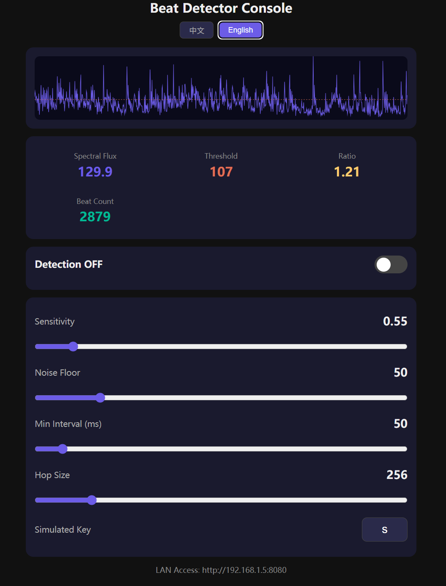

# fh6 Beat Detector 🥁 | 鼓点检测器

[🇨🇳 中文](#chinese) | [🇺🇸 English](#english)

---

<a name="chinese"></a>

## 🇨🇳 中文

一个实时鼓点检测工具，通过 WASAPI 回环捕获系统音频，使用频谱通量分析检测鼓点，并在每个节拍上模拟键盘输入。

### 功能特性

- **实时检测** — 基于频谱通量分析，支持自适应阈值和多频段加权
- **Web 控制面板** — 内置 HTTP 服务器（端口 8080），支持远程监控和参数调整
- **多语言** — Web 界面支持中文 / 英文切换
- **低延迟** — WASAPI 回环捕获，可配置处理步长
- **高度可配** — 灵敏度、噪声底线、最小间隔、模拟按键均可通过 Web UI 或命令行调整
- **零额外依赖** — 仅需 NumPy；Web 服务器使用 Python 标准库

### 🎮 Forza Horizon 应用场景



本项目专为 **Forza Horizon 3 / 4 / 5 / 6**（极限竞速：地平线 3~6 代）的刹车灯音乐联动而设计。

通过 Python 实时检测音乐中的鼓点/节拍，模拟外接键盘输入来触发游戏中的刹车动作，使车辆刹车灯跟随音乐节奏闪烁，营造极具观赏性的节奏灯光效果。

> **使用前请务必注意：**
>
> - 游戏中必须切换为 **手动挡**（Manual Transmission），否则刹车灯联动无法正常工作
> - 推荐使用 **外接键盘** 绑定刹车按键，避免干扰正常游戏操作
> - 将配置文件中的 `keybind` 设为外接键盘上对应刹车输入的按键

**使用方法：**
1. 进入 Forza Horizon 游戏设置，将变速箱模式切换为 **手动挡**
2. 准备一个外接键盘，确认其刹车按键映射
3. 修改 `config.json` 中的 `keybind` 为对应的按键（默认为 `s`）
4. 运行程序，播放音乐，刹车灯将自动跟随节拍亮起 🎵

### 环境要求

- Windows 10/11
- Python 3.10+
- NumPy

### 快速开始

```bash
pip install -r requirements.txt
python -m beat_detector.main
```

然后在浏览器中打开 **http://localhost:8080**（局域网内其他设备也可访问）。

### 命令行参数

```
python -m beat_detector.main [选项]

选项:
  -c, --config PATH      配置文件路径（默认: config.json）
  -s, --sensitivity N    检测灵敏度（0.1–5.0）
  -k, --keybind KEY      模拟的按键（默认: s）
  -i, --min-interval MS  触发最小间隔（毫秒）
  -d, --show-debug       打印逐帧调试信息
  --list-devices         列出音频设备并退出
```

### 配置说明

编辑 `beat_detector/config.json` 或使用 Web 控制面板调整：

| 参数 | 默认值 | 说明 |
|---------|---------|-------------|
| `sensitivity` | 1.5 | 检测灵敏度（越低越容易触发） |
| `noise_floor` | 50.0 | 触发的最低通量值 |
| `min_interval_ms` | 50 | 两次触发之间的最小间隔 |
| `hop_size` | 256 | FFT 帧间跳步间隔（采样点数）。值越大，每秒处理帧数越少，CPU 占用越低，但节奏检测精度也会降低 |
| `keybind` | "s" | 检测到鼓点时模拟的按键 |
| `frequency_bands` | 3 个频段 | 频率范围及权重配置 |

### 工作原理

1. **音频捕获** — WASAPI 回环实时捕获系统音频
2. **FFT 变换** — 将音频帧通过 FFT 转换到频域
3. **频谱通量** — 计算各频段的正能量差来检测音频起始点
4. **自适应阈值** — 滚动均值 + 加权标准差过滤噪声
5. **按键模拟** — Windows `keybd_event` API 发送配置的按键

---

<a name="english"></a>

## 🇺🇸 English

A real-time drum beat detector that captures system audio via WASAPI loopback, detects drum onsets using spectral flux analysis, and simulates keyboard input synced to music beats.

### Features

- **Real-time Detection** — Spectral flux analysis with adaptive thresholding and multi-band frequency weighting
- **Web Control Panel** — Built-in HTTP server on port 8080 for remote monitoring and configuration
- **Multi-language** — Chinese / English language switching in the web UI
- **Low Latency** — WASAPI loopback capture with configurable hop size
- **Configurable** — Sensitivity, noise floor, minimum interval, key binding all adjustable via web UI or CLI
- **Zero Extra Dependencies** — Only requires NumPy; web server uses Python standard library

### 🎮 Forza Horizon Use Case


This project is purpose-built for **Forza Horizon 3 / 4 / 5 / 6** brake light music sync.

It detects drum beats and rhythm in real-time via Python, then simulates keyboard input to trigger the brake action in-game — making your car's brake lights flash in perfect sync with the music for a stunning visual effect.

> **Important notes before use:**
>
> - You **must switch to Manual Transmission** in-game, otherwise the brake light sync will not work
> - An **external keyboard** is highly recommended for binding the brake key, so it won't interfere with normal gameplay
> - Set the `keybind` in config to the brake key mapped on your external keyboard

**How to use:**
1. In Forza Horizon settings, switch the transmission to **Manual**
2. Prepare an external keyboard and confirm its brake key mapping
3. Update `config.json` with the correct `keybind` (default: `s`)
4. Launch the program, play some music, and watch your brake lights pulse to the beat 🎵

### Requirements

- Windows 10/11
- Python 3.10+
- NumPy

### Quick Start

```bash
pip install -r requirements.txt
python -m beat_detector.main
```

Then open **http://localhost:8080** in your browser (works from any device on the same LAN).

### Command Line Options

```
python -m beat_detector.main [OPTIONS]

Options:
  -c, --config PATH      Path to config JSON (default: config.json)
  -s, --sensitivity N    Detection sensitivity (0.1–5.0)
  -k, --keybind KEY      Key to press on beat (default: s)
  -i, --min-interval MS  Minimum ms between triggers
  -d, --show-debug       Print per-frame debug info
  --list-devices         List audio devices and exit
```

### Configuration

Edit `beat_detector/config.json` or use the web control panel:

| Setting | Default | Description |
|---------|---------|-------------|
| `sensitivity` | 1.5 | Detection sensitivity (lower = more easy triggers) |
| `noise_floor` | 50.0 | Minimum flux value to trigger |
| `min_interval_ms` | 50 | Minimum time between beats |
| `hop_size` | 256 | Hop interval between FFT frames in samples. Larger = fewer frames/sec, less CPU, coarser beat resolution |
| `keybind` | "s" | Key to simulate on beat |
| `frequency_bands` | 3 bands | Frequency ranges with weights |

### How It Works

1. **Capture** — WASAPI loopback captures system audio in real-time
2. **FFT** — Audio frames are transformed to frequency domain via FFT
3. **Spectral Flux** — Positive energy differences across frequency bands detect onsets
4. **Adaptive Threshold** — Rolling mean + weighted standard deviation filters noise
5. **Key Simulation** — Windows `keybd_event` API sends the configured key

---

## License | 许可证

MIT
